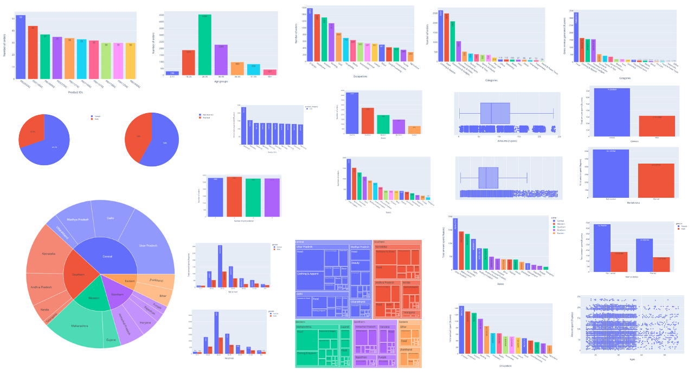

# Diwali Sales: Exploratory Data Analysis & Visualization

Kaggle notebook: https://www.kaggle.com/code/navanitnandakumar/diwali-sales-eda/notebook

Kaggle dataset: https://www.kaggle.com/datasets/prajwal6362venom/diwali-sales

Analyzing sales during special or festive occasions is important for businesses to understand the impact of these occasions on their sales and to make informed decisions about their marketing strategies. Businesses can use this opportunity to increase their sales by offering discounts, promotions, and other incentives to attract customers. By analyzing sales data during these periods, businesses can identify trends and patterns in customer behavior, which can help them optimize their marketing strategies and improve their sales performance.

In this project, I have analyzed and visualized sales data for an Indian retail company during the Diwali festive season. This involved data cleaning and preparation using pandas, followed by exploratory data analysis to reveal key insights. Additionally, I created interactive plots and visualizations using Plotly.
